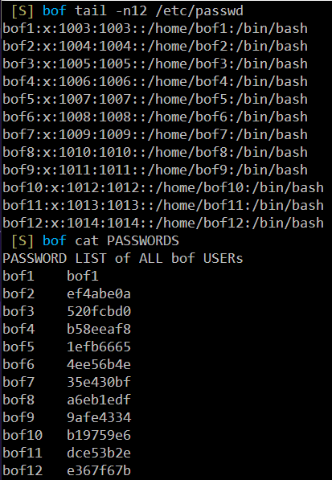
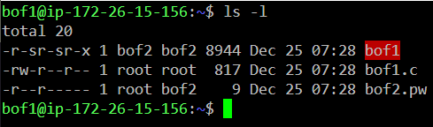

# bof

## Setup BOF CTF

```shell
git clone https://github.com/ccss17/bof
cd bof
./setup.sh
```

Then, check created bof users and their passwords

```shell
tail -n12 /etc/passwd
cat PASSWORDS
```



First CTF stage is `bof1`. Login with SSH ID `bof1` and password `bof1`.



Then exploit `bof1` to get password of `bof2` in `bof2.pw`.

## Exploit

TODO